# MediChain — Level 3 Production-Grade Inter-Contract Health Exchange

[](https://stellar.org/soroban)
[](LICENSE)
[](https://github.com/prateekpatel00/MediChain/actions)
[](https://nextjs.org/)
[](https://vitest.dev/)

> **MediChain** is a Level 3 production-grade, decentralized, privacy-preserving inter-hospital medical data exchange dApp built on **Stellar Soroban smart contracts**. It solves data silos in healthcare while ensuring 100% HIPAA compliance through on-chain cryptographic record anchoring, cross-contract authorization, and zero PHI on-chain.

---

## 🔗 Project Links & Placeholders

- **Live Demo App**: `LIVE_DEMO`
- **Video Walkthrough & Demo**: `DEMO_VIDEO_LINK`
- **GitHub Repository**: [https://github.com/prateekpatel00/MediChain](https://github.com/prateekpatel00/MediChain)
- **Registry Smart Contract (Testnet)**: `CONTRACT_ADDRESSES`
- **Core Logic Smart Contract (Testnet)**: `CONTRACT_ADDRESSES`
- **Sample Transaction Hash (Testnet)**: `TRANSACTION_HASH`

---

## 🎯 Problem & Solution Overview

### The Problem
- **Siloed Medical Records**: Patient records are trapped inside isolated hospital EMR databases. When patients transfer between hospitals (e.g. from Apollo Bangalore to AIIMS Jabalpur), critical diagnostic histories are delayed or missing.
- **Privacy & HIPAA Violations**: Sharing raw patient files over unencrypted networks or storing sensitive Protected Health Information (PHI) directly on public blockchains violates global health privacy regulations (HIPAA, GDPR).
- **Unauthorized Data Access**: Lack of centralized, tamper-proof audit trails for inter-hospital record requests allows unauthorized data exposure.

### The Solution: MediChain Architecture
- **Dual Soroban Smart Contract Ecosystem**:
  1. **Registry Contract (`medichain-registry`)**: Governed by the Ministry of Health (Super Admin) to maintain an authorized whitelist of verified hospital nodes.
  2. **Core Logic Contract (`medichain-core`)**: Manages record metadata (IPFS CIDs) and inter-hospital access requests. Performs **on-chain cross-contract calls** to the Registry Contract before executing write operations.
- **Zero PHI On-Chain**: Only 256-bit SHA-256 cryptographic hashes and IPFS CIDs are anchored on the Soroban ledger. Actual diagnostic reports and PDFs are encrypted and pinned off-chain via IPFS.
- **Multi-Wallet Support**: Full integration with **StellarWalletsKit** supporting Freighter, Albedo, xBull, Hana, and LOBSTR wallets.

---

## 🏗️ System Architecture & Inter-Contract Communication

```mermaid
sequenceDiagram
    autonumber
    actor Hospital as 🏥 Hospital Node (Wallet)
    participant Core as 📜 Core Logic Contract<br/>(medichain-core)
    participant Registry as 🛡️ Registry Contract<br/>(medichain-registry)
    participant IPFS as 📦 IPFS / Decentralized Storage
    actor Admin as 🏛️ Govt Super Admin

    note over Admin, Registry: Phase 1: On-Chain Whitelisting (RBAC)
    Admin->>Registry: initialize(admin_address)
    Admin->>Registry: add_hospital(admin, hospital_address)
    Registry-->>Registry: require_auth() + persist to storage

    note over Hospital, IPFS: Phase 2: Record Upload & Cross-Contract Verification
    Hospital->>IPFS: Upload encrypted PDF / Medical Report
    IPFS-->>Hospital: Return IPFS CID (Qm...)
    Hospital->>Core: upload_record(hospital_address, patient_id, ipfs_cid)
    Core->>Core: hospital.require_auth()
    
    rect rgb(20, 50, 80)
        note over Core, Registry: Cross-Contract Call (Atomic XDR Execution)
        Core->>Registry: is_authorized(hospital_address)
        Registry-->>Core: Returns true (Authorized) or false (Denied)
    end

    alt Hospital is Authorized
        Core-->>Core: Persist RecordMeta (patient_id -> ipfs_cid)
        Core-->>Hospital: ✅ Transaction Confirmed (Tx Hash)
    else Hospital Not Whitelisted
        Core-->>Hospital: ❌ Panic: CoreError::HospitalNotAuthorized (Tx Reverted)
    end

    note over Hospital, Core: Phase 3: Inter-Hospital Access Control
    actor Requester as 🏥 Requester Hospital (AIIMS)
    Requester->>Core: request_access(requester, target_hosp, patient_id, reason)
    Core->>Registry: is_authorized(requester) [Cross-Contract Call]
    Registry-->>Core: true
    Core-->>Core: Store AccessRequest (Status: Pending)

    Hospital->>Core: approve_access(target_hosp, requester, patient_id)
    Core-->>Core: Set Grant Bit (Status: Approved)

    Requester->>Core: view_record(requester, patient_id)
    Core->>Core: Verify Access Grant Bit
    Core-->>Requester: Return IPFS CID (Qm...)
    Requester->>IPFS: Fetch & Decrypt Diagnostic Report
```



---

## 🛠️ Technology Stack

| Layer | Component | Description |
|---|---|---|
| **Blockchain** | Stellar Soroban | Smart contract environment (Rust, Soroban SDK v21) |
| **Smart Contract 1** | `medichain-registry` | Hospital whitelist authorization & admin RBAC |
| **Smart Contract 2** | `medichain-core` | Record hash storage & inter-hospital permission matrix |
| **Cross-Contract** | Soroban Trait Client | Typed client calls between Core & Registry contracts |
| **Frontend** | Next.js 14 (App Router) | React 18, TypeScript 5, Tailwind CSS |
| **Wallet Integration** | `@creit.tech/stellar-wallets-kit` | Freighter, Albedo, xBull, Hana, LOBSTR |
| **State & Activity** | React Context + LocalStorage | Global `WalletContext` & `TransactionContext` |
| **Testing** | Vitest + Testing Library | 3 unit test suites for components, hooks, & UI |
| **Contract Testing** | Soroban `Env` Testutils | 7 Rust integration tests with real WASM compilation |
| **CI/CD** | GitHub Actions | Automated lint, typecheck, test, build, and deploy pipeline |

---

## 📂 Repository Structure

```
MediChain/
├── .github/
│   └── workflows/
│       └── deploy.yml              # GitHub Actions CI/CD Pipeline
├── contracts/                      # Cargo Workspace
│   ├── Cargo.toml                  # Workspace Manifest (registry + core)
│   ├── registry/                   # REGISTRY CONTRACT
│   │   ├── Cargo.toml
│   │   └── src/lib.rs              # Whitelist & Admin logic
│   └── core/                       # CORE LOGIC CONTRACT
│       ├── Cargo.toml
│       └── src/
│           ├── lib.rs              # Record & Access logic with Cross-Contract calls
│           └── test.rs             # 7 Integration Tests (Real WASM cross-calls)
├── frontend/                       # NEXT.JS FRONTEND dAPP
│   ├── src/
│   │   ├── app/
│   │   │   ├── page.tsx            # Landing Page
│   │   │   ├── govt/page.tsx       # Government Super Admin Portal
│   │   │   ├── hospital/page.tsx   # Hospital Action Center
│   │   │   ├── transactions/page.tsx # Transaction Center & Activity Feed
│   │   │   └── layout.tsx          # Root Layout (Providers + Toasts)
│   │   ├── components/
│   │   │   ├── Header.tsx          # Universal Responsive Header with Mobile Menu
│   │   │   └── WalletModal.tsx     # StellarWalletsKit Selection Dialog
│   │   ├── context/
│   │   │   ├── WalletContext.tsx   # Multi-wallet & session context
│   │   │   └── TransactionContext.tsx # Persistent lifecycle activity store
│   │   ├── hooks/
│   │   │   └── useStellar.ts       # Custom React Hook for Soroban calls
│   │   ├── services/
│   │   │   └── stellar.ts          # Soroban RPC simulation & assembly service
│   │   ├── types/
│   │   │   └── medichain.ts        # TypeScript Type Definitions
│   │   └── __tests__/              # Vitest Frontend Test Suite
│   ├── package.json
│   └── vitest.config.mts
├── deploy.sh                       # Shell script for building & deploying both WASMs
├── CHANGELOG.md                    # Git development history log
└── README.md                       # Production Documentation
```

---

## ⚙️ Setup & Local Installation

### Prerequisites
- **Rust & Cargo**: `rustup target add wasm32-unknown-unknown`
- **Stellar CLI**: Install `stellar-cli` (v21+)
- **Node.js**: v20+ & npm

### 1. Smart Contracts Setup & Testing
```bash
# Clone the repository
git clone https://github.com/prateekpatel00/MediChain.git
cd MediChain/contracts

# Check compilation of both workspace crates
cargo check --workspace

# Build Registry contract WASM (required for cross-contract tests)
cargo build --package medichain-registry --target wasm32-unknown-unknown --release

# Run all 7 Soroban integration tests
cargo test --workspace
```

### 2. Next.js Frontend Setup & Testing
```bash
cd ../frontend

# Install dependencies with legacy peer deps
npm install --legacy-peer-deps

# Run TypeScript type check
npx tsc --noEmit

# Run Vitest test suite (3 tests)
npm run test

# Run Next.js dev server
npm run dev
```

### 3. Automated On-Chain Deployment (`deploy.sh`)
```bash
# Execute deployment script in Git Bash / WSL
bash deploy.sh
```
This script automatically:
1. Builds both `medichain-registry.wasm` and `medichain-core.wasm`.
2. Deploys `Registry Contract` to Stellar Testnet and captures ID.
3. Deploys `Core Contract` to Stellar Testnet and captures ID.
4. Initializes Registry with Govt Admin address.
5. Initializes Core with Registry Contract ID.
6. Overwrites `frontend/.env.local` with deployed IDs.

---

## 🧪 Testing Suite & Coverage

### Smart Contract Integration Tests (`contracts/core/src/test.rs`)
| Test | Description | Result |
|---|---|---|
| `test_01_initialize_and_link_registry` | Verifies Core stores Registry ID correctly | ✅ Passed |
| `test_02_upload_record_authorized_hospital_succeeds` | Happy path: Authorized hospital uploads → cross-contract call succeeds | ✅ Passed |
| `test_03_upload_record_unauthorized_hospital_panics` | Failure path: Non-whitelisted hospital → panics `HospitalNotAuthorized` | ✅ Passed |
| `test_04_request_access_unauthorized_requester_panics` | Failure path: Unauthorized requester → panics `HospitalNotAuthorized` | ✅ Passed |
| `test_05_full_access_lifecycle_with_cross_contract` | End-to-end: Upload → Request → Approve → View → Reject | ✅ Passed |
| `test_06_revoked_hospital_upload_is_denied` | Simulates revoked hospital → upload fails | ✅ Passed |
| `test_07_core_not_initialized_panics` | Calling methods prior to `initialize()` → panics `NotInitialized` | ✅ Passed |

### Frontend Vitest Suite (`frontend/src/__tests__/`)
| Test File | Description | Result |
|---|---|---|
| `WalletContext.test.tsx` | Verifies default disconnected state and provider context | ✅ Passed |
| `Header.test.tsx` | Verifies brand logo, navigation links (`/`, `/govt`, `/hospital`, `/transactions`), and connect button | ✅ Passed |
| `Transactions.test.tsx` | Verifies Transaction Center rendering, filter tabs, search, and pre-seeded history | ✅ Passed |

---

## 🚀 CI/CD Pipeline & GitHub Actions

The repository includes an automated GitHub Actions pipeline (`.github/workflows/deploy.yml`) that triggers on every push or pull request to `main`:

```yaml
Jobs:
  1. Checkout code
  2. Setup Node.js 20 & npm cache
  3. Install dependencies (`npm install --legacy-peer-deps`)
  4. Run Next.js Linter (`npm run lint`)
  5. Run TypeScript Type Check (`npx tsc --noEmit`)
  6. Run Vitest Unit Tests (`npm run test`)
  7. Build Production Bundle (`npm run build`)
  8. Simulate Deployment Step
```

---

## 🔒 Security Considerations

1. **Strict Signature Checks**: Every mutating operation enforces `require_auth()` for the caller's address.
2. **Cross-Contract Verification**: Core Contract directly invokes `registry.is_authorized(hospital)` on-chain via Soroban XDR. A non-whitelisted hospital cannot upload records even if it bypasses frontend controls.
3. **Zero Raw Data On-Chain**: Protected Health Information (PHI) is NEVER placed on the ledger. Only cryptographic SHA-256 binary file hashes and IPFS CIDs are anchored.
4. **Human-Readable Error Formatting**: Custom error parsing prevents unhandled promise rejections and gives clear feedback for wallet rejections or RBAC denials.

---

## 👨‍💻 Author & Credits

- **Author**: Prateek Patel ([@prateekpatel00](https://github.com/prateekpatel00))
- **Role**: Senior Stellar Ecosystem & Full-Stack Engineer
- **Repository**: [https://github.com/prateekpatel00/MediChain](https://github.com/prateekpatel00/MediChain)
- **Built for**: Stellar Soroban Ecosystem Level 3 Upgrade

---

*MediChain — Building the Future of Privacy-Preserving Interoperable Healthcare on Stellar.*