# MediChain — Level 3 Production-Grade Inter-Contract Health Exchange

[](https://stellar.org/soroban)
[](LICENSE)
[](https://github.com/prateekpatel00/MediChain/actions)
[](https://nextjs.org/)
[](https://vitest.dev/)

> **MediChain** is a Level 3 production-grade, decentralized, privacy-preserving inter-hospital medical data exchange dApp built on **Stellar Soroban smart contracts**. It solves data silos in healthcare while ensuring 100% HIPAA compliance through on-chain cryptographic record anchoring, cross-contract authorization, and zero PHI on-chain.

---

## 🔗 Live Deployed Smart Contracts (Stellar Testnet)

- **Registry Smart Contract**: [`CBPLLSMAACN3LJVNZKCUAHDA557BBGB2A2U2QUZTJIKOR7VI6BNHTTKK`](https://stellar.expert/explorer/testnet/contract/CBPLLSMAACN3LJVNZKCUAHDA557BBGB2A2U2QUZTJIKOR7VI6BNHTTKK)
- **Core Logic Smart Contract**: [`CAS6FT2W6DIF2OAX4XWGZDPBPDLTAC4QTHEGQZJQ6VMDBWRPOT4NT6DS`](https://stellar.expert/explorer/testnet/contract/CAS6FT2W6DIF2OAX4XWGZDPBPDLTAC4QTHEGQZJQ6VMDBWRPOT4NT6DS)
- **Super-Admin Owner (Freighter Key)**: [`GCVGEHLD34OAWVIQYWYNLEU2YFOXINO4FEXLGPV6DBHFIFDQFCWQJDI5`](https://stellar.expert/explorer/testnet/account/GCVGEHLD34OAWVIQYWYNLEU2YFOXINO4FEXLGPV6DBHFIFDQFCWQJDI5)
- **GitHub Repository**: [https://github.com/prateekpatel00/MediChain](https://github.com/prateekpatel00/MediChain)

---

## 🎯 Problem & Solution Overview

### The Problem
- **Siloed Medical Records**: Patient records are trapped inside isolated hospital EMR databases. When patients transfer between hospitals, critical diagnostic histories are delayed or missing.
- **Privacy & HIPAA Violations**: Sharing raw patient files over unencrypted networks or storing sensitive Protected Health Information (PHI) directly on public blockchains violates global health privacy regulations (HIPAA, GDPR).
- **Unauthorized Data Access**: Lack of centralized, tamper-proof audit trails for inter-hospital record requests allows unauthorized data exposure.

### The Solution: MediChain Architecture
- **Dual Soroban Smart Contract Ecosystem**:
  1. **Registry Contract (`medichain-registry`)**: Governed strictly by the Super Admin owner (`GCVGEHLD34OAWVIQYWYNLEU2YFOXINO4FEXLGPV6DBHFIFDQFCWQJDI5`) to maintain an authorized whitelist of verified hospital nodes via `add_hospital()`.
  2. **Core Logic Contract (`medichain-core`)**: Manages record metadata (IPFS CIDs) and inter-hospital access requests. Performs **on-chain cross-contract calls** to the Registry Contract before executing write operations.
- **Zero PHI On-Chain**: Only 256-bit SHA-256 cryptographic hashes and IPFS CIDs are anchored on the Soroban ledger. Actual diagnostic reports and PDFs are encrypted and pinned off-chain via IPFS.
- **Multi-Wallet Support**: Full integration with **StellarWalletsKit** supporting Freighter, Albedo, xBull, Hana, and LOBSTR wallets.

---

## 🏗️ System Architecture & Inter-Contract Communication

```mermaid
sequenceDiagram
    autonumber
    actor Admin as 🏛️ Super Admin (Freighter Wallet)
    participant Registry as 🛡️ Registry Contract<br/>(CBPLLSMAACN3LJVNZK...)
    participant Core as 📜 Core Logic Contract<br/>(CAS6FT2W6DIF2OAX...)
    actor Hospital as 🏥 Hospital Node (Wallet)
    participant IPFS as 📦 IPFS / Decentralized Storage

    note over Admin, Registry: Phase 1: On-Chain Whitelisting (Super-Admin RBAC)
    Admin->>Registry: initialize(admin = GCVGEHLD34OAWVIQ...) [Genesis Deployment]
    Admin->>Registry: add_hospital(admin, hospital_address)
    Registry-->>Registry: admin.require_auth() + verify stored_admin == admin

    note over Hospital, IPFS: Phase 2: Record Upload & Cross-Contract Verification
    Hospital->>IPFS: Upload encrypted PDF / Medical Report
    IPFS-->>Hospital: Return IPFS CID (Qm...)
    Hospital->>Core: upload_record(hospital_address, patient_id, ipfs_cid)
    Core->>Core: hospital.require_auth()
    
    rect rgb(20, 50, 80)
        note over Core, Registry: Cross-Contract Call (Atomic XDR Execution)
        Core->>Registry: is_authorized(hospital_address)
        Registry-->>Core: Returns true (Authorized) or false (Denied)
    end

    alt Hospital is Authorized
        Core-->>Core: Persist RecordMeta (patient_id -> ipfs_cid)
        Core-->>Hospital: ✅ Transaction Confirmed (Tx Hash)
    else Hospital Not Whitelisted
        Core-->>Hospital: ❌ Panic: CoreError::HospitalNotAuthorized (Tx Reverted)
    end

    note over Hospital, Core: Phase 3: Inter-Hospital Access Control
    actor Requester as 🏥 Requester Hospital
    Requester->>Core: request_access(requester, target_hosp, patient_id, reason)
    Core->>Registry: is_authorized(requester) [Cross-Contract Call]
    Registry-->>Core: true
    Core-->>Core: Store AccessRequest (Status: Pending)

    Hospital->>Core: approve_access(target_hosp, requester, patient_id)
    Core-->>Core: Verify Access Grant Bit

    Requester->>Core: view_record(requester, patient_id)
    Core->>Core: Verify Access Grant Bit
    Core-->>Requester: Return IPFS CID (Qm...)
    Requester->>IPFS: Fetch & Decrypt Diagnostic Report
```



---

## 🛠️ Technology Stack

| Layer | Component | Description |
|---|---|---|
| **Blockchain** | Stellar Soroban | Smart contract environment (Rust, Soroban SDK v21) |
| **Smart Contract 1** | `medichain-registry` | Hospital whitelist authorization & admin RBAC |
| **Smart Contract 2** | `medichain-core` | Record hash storage & inter-hospital permission matrix |
| **Cross-Contract** | Soroban Trait Client | Typed client calls between Core & Registry contracts |
| **Frontend** | Next.js 14 (App Router) | React 18, TypeScript 5, Tailwind CSS |
| **Wallet Integration** | `@creit.tech/stellar-wallets-kit` | Freighter, Albedo, xBull, Hana, LOBSTR |
| **State & Activity** | React Context + LocalStorage | Global `WalletContext`, `AuthContext`, & `TransactionContext` |
| **Testing** | Vitest + Testing Library | 3 unit test suites for components, hooks, & UI |
| **Contract Testing** | Soroban `Env` Testutils | 7 Rust integration tests with real WASM compilation |
| **CI/CD** | GitHub Actions | Automated lint, typecheck, test, build, and deploy pipeline |

---

## ⚙️ Setup & Local Installation

```bash
# Clone repository
git clone https://github.com/prateekpatel00/MediChain.git
cd MediChain/contracts

# Run smart contract test suite (7 passing tests)
cargo test --workspace

# Frontend setup & tests
cd ../frontend
npm install --legacy-peer-deps
npx tsc --noEmit
npm run test
npm run dev
```

---

## 👨‍💻 Author & Credits

- **Author**: Prateek Patel ([@prateekpatel00](https://github.com/prateekpatel00))
- **Role**: Senior Stellar Ecosystem & Security Auditor
- **Repository**: [https://github.com/prateekpatel00/MediChain](https://github.com/prateekpatel00/MediChain)
- **Built for**: Stellar Soroban Ecosystem Level 3 Production Upgrade