# 🏥 MediChain — Decentralized Inter-Hospital Healthcare Data Protocol

[](https://stellar.org/soroban)
[](LICENSE)
[](https://github.com/prateekpatel00/MediChain/actions)
[](https://nextjs.org/)
[](https://vitest.dev/)

> **MediChain** is an enterprise-grade, privacy-preserving inter-hospital medical record exchange protocol built on **Stellar Soroban smart contracts**. It eliminates healthcare data silos between medical institutions while maintaining 100% HIPAA compliance through on-chain cryptographic anchoring, dual-contract cross-invocation authorization, and zero on-chain Protected Health Information (PHI).

---

## 🎯 The Problem & The Solution

### ❌ The Healthcare Data Silo Problem
* **EMR Fragmentation**: Patient diagnostic records (MRI scans, bloodwork, cardiology reports) are locked inside isolated hospital EMR databases. When patients transfer between facilities, critical histories are delayed or duplicated.
* **Privacy & Regulatory Risk**: Storing sensitive Protected Health Information (PHI) directly on public blockchains violates global privacy frameworks (HIPAA, GDPR) and incurs severe legal liabilities.
* **Access Control Ambiguity**: Centralized record request portals lack immutable, tamper-proof access logs, exposing institutions to unauthorized data leaks and credential abuse.

### ✅ The MediChain Solution
* **Dual Soroban Smart Contract Architecture**:
  1. **Registry Contract (`medichain-registry`)**: Governed strictly by the Ministry of Health / Government Super Admin (`GCVGEHLD34OAWVIQYWYNLEU2YFOXINO4FEXLGPV6DBHFIFDQFCWQJDI5`) to maintain an authorized whitelist of verified healthcare nodes.
  2. **Core Logic Contract (`medichain-core`)**: Handles medical record metadata (IPFS CIDs) and inter-hospital access requests. Executes **atomic cross-contract calls** to the Registry Contract before performing any state modification.
* **Zero PHI On-Chain**: Only 256-bit SHA-256 cryptographic hashes and IPFS Content Identifiers (CIDs) are anchored on the Soroban ledger. Actual medical documents remain encrypted off-chain on IPFS nodes.
* **Unified Multi-Wallet Integration**: Built using `@creit.tech/stellar-wallets-kit`, enabling seamless authentication with Freighter, Albedo, xBull, Hana, and LOBSTR wallets.

---

## 📑 Stellar Level 3 Requirements Checklist

| Requirement | Implementation Detail | Status |
| :--- | :--- | :---: |
| **Dual Inter-Contract Calls** | `CoreContract` invokes `RegistryClient::is_authorized()` via typed cross-contract XDR call before record uploads or access grants | `PASSED` ✅ |
| **Strict Role-Based Access Control** | Super-Admin governance on `RegistryContract::add_hospital()` via `admin.require_auth()` and stored owner validation | `PASSED` ✅ |
| **Custom Error Handling & Guards** | Strongly typed Rust `#[contracterror]` enums (`RegistryError`, `CoreError`) preventing invalid state transitions | `PASSED` ✅ |
| **Automated E2E Integration Test** | Automated shell script (`scripts/test_e2e_flow.sh`) testing full multi-hospital data exchange on Stellar Testnet | `PASSED` ✅ |
| **Unit & Integration Test Suite** | 7 Soroban SDK Rust unit tests + 3 Vitest frontend test suites covering components, contexts, and hooks | `PASSED` ✅ |
| **CI/CD Pipeline Integration** | GitHub Actions workflow (`.github/workflows/deploy.yml`) testing, building, and deploying contracts on release | `PASSED` ✅ |
| **Production Multi-Wallet Support** | Integrated StellarWalletsKit with official enterprise branding, responsive dark/light modes, and route guards | `PASSED` ✅ |

---

## 🏗️ System Architecture & Cross-Contract Flow

```mermaid
sequenceDiagram
    autonumber
    actor Admin as 🏛️ Super Admin (Freighter Wallet)
    participant Registry as 🛡️ Registry Contract (Soroban)
    participant Core as 📜 Core Logic Contract (Soroban)
    actor HospA as 🏥 Hospital Node A (Apollo)
    actor HospB as 🏥 Hospital Node B (Fortis)
    participant IPFS as 📦 Off-Chain IPFS Network

    note over Admin, Registry: Phase 1: On-Chain Whitelisting (Super-Admin Governance)
    Admin->>Registry: initialize(admin_address = GCVGEHLD34...)
    Admin->>Registry: add_hospital(admin, hospital_a_address)
    Registry-->>Registry: admin.require_auth() + verify admin == stored_admin

    note over HospA, IPFS: Phase 2: Record Upload & Cross-Contract Verification
    HospA->>IPFS: Upload encrypted PDF diagnostic report
    IPFS-->>HospA: Return IPFS CID (Qm...)
    HospA->>Core: upload_record(hospital_a, patient_id, ipfs_cid)
    Core->>Core: hospital_a.require_auth()
    
    rect rgb(15, 30, 50)
        note over Core, Registry: Atomic Cross-Contract Call
        Core->>Registry: is_authorized(hospital_a)
        Registry-->>Core: true (Authorized) / false (Denied)
    end

    alt Hospital Node is Authorized
        Core-->>Core: Persist RecordMeta (patient_id -> ipfs_cid)
        Core-->>HospA: ✅ Record Anchored on Stellar Testnet
    else Hospital Node Not Whitelisted
        Core-->>HospA: ❌ Revert: CoreError::HospitalNotAuthorized
    end

    note over HospB, Core: Phase 3: Inter-Hospital Request & Access Grant
    HospB->>Core: request_access(requester, target_hospital, patient_id, reason)
    Core->>Registry: is_authorized(requester) [Cross-Contract Call]
    Registry-->>Core: true
    Core-->>Core: Store AccessRequest (Status: Pending)

    HospA->>Core: approve_access(target_hospital, requester, patient_id)
    Core-->>Core: Persist Explicit Access Grant Bit

    HospB->>Core: view_record(requester, patient_id)
    Core->>Core: Verify Explicit Access Grant Bit
    Core-->>HospB: Return IPFS CID (Qm...)
    HospB->>IPFS: Fetch & Decrypt Patient Report
```



---

## 🔗 Live Deployed Smart Contracts (Stellar Testnet)

The smart contracts are live and verified on the **Stellar Testnet Network**:

| Contract / Identity | Public Key / Contract ID | Explorer Link |
| :--- | :--- | :--- |
| **Registry Smart Contract** | `CDD5BMSSEQSLBFQCZYYGFUNWJ5BH243YE7NHZSZJCZAICMRYXI7RCMJS` | [Stellar Expert Registry](https://stellar.expert/explorer/testnet/contract/CDD5BMSSEQSLBFQCZYYGFUNWJ5BH243YE7NHZSZJCZAICMRYXI7RCMJS) |
| **Core Logic Smart Contract** | `CD4AOWVNSBCQPVMSNCSYKA5RI3Z24RH6UNXS3KTVQQW3ZDQJOJPFL4HB` | [Stellar Expert Core](https://stellar.expert/explorer/testnet/contract/CD4AOWVNSBCQPVMSNCSYKA5RI3Z24RH6UNXS3KTVQQW3ZDQJOJPFL4HB) |
| **Super Admin Owner Key** | `GCVGEHLD34OAWVIQYWYNLEU2YFOXINO4FEXLGPV6DBHFIFDQFCWQJDI5` | [Stellar Expert Account](https://stellar.expert/explorer/testnet/account/GCVGEHLD34OAWVIQYWYNLEU2YFOXINO4FEXLGPV6DBHFIFDQFCWQJDI5) |

> 📌 **Deployment Placeholder Note for Custom Testnet**:
> ```env
> NEXT_PUBLIC_REGISTRY_CONTRACT_ID=CDD5BMSSEQSLBFQCZYYGFUNWJ5BH243YE7NHZSZJCZAICMRYXI7RCMJS
> NEXT_PUBLIC_CORE_CONTRACT_ID=CD4AOWVNSBCQPVMSNCSYKA5RI3Z24RH6UNXS3KTVQQW3ZDQJOJPFL4HB
> ```

---

## ⚙️ Local Setup, Build & Automated Testing

### 1. Prerequisites
Ensure you have the following installed on your system:
* [Rust](https://www.rust-lang.org/) `1.80+` with target `wasm32-unknown-unknown`
* [Stellar CLI](https://developers.stellar.org/docs/build/smart-contracts/getting-started/setup#install-the-stellar-cli) (`v21.0.0+`)
* [Node.js](https://nodejs.org/) `18+` & `npm`

### 2. Clone Repository & Build Smart Contracts
```bash
# Clone the repository
git clone https://github.com/prateekpatel00/MediChain.git
cd MediChain

# Navigate to contracts directory and run Rust contract test suite
cd contracts
cargo test --workspace
```

### 3. Automated End-to-End (E2E) Integration Testing
Run the automated CLI integration test script to simulate full multi-hospital data exchange and negative RBAC security checks on Stellar Testnet:
```bash
# Run E2E test script via npm alias
cd ../frontend
npm run test:e2e

# Or execute the bash script directly
bash ../scripts/test_e2e_flow.sh
```

### 4. Deploy Smart Contracts & Start Frontend
```bash
# Deploy contracts to Stellar Testnet (updates frontend/.env.local automatically)
cd ..
bash deploy.sh

# Run Next.js Web App
cd frontend
npm install
npm run dev
```
Open [http://localhost:3000](http://localhost:3000) in your browser.

### 5. Connecting Browser Wallet (Freighter)
1. Install the [Freighter Wallet Browser Extension](https://www.freighter.app/).
2. Open Freighter settings and switch Network to **Test Network**.
3. Fund your test account via the [Stellar Testnet Laboratory Friendbot](https://laboratory.stellar.org/#account-creator).
4. Click **"Connect Wallet"** on MediChain to interact with live Soroban smart contracts!

---

## 🛠️ Technology Stack Overview

```
MediChain Ecosystem
 ├── Soroban Smart Contracts (Rust)
 │    ├── medichain-registry (Hospital Whitelist & Admin RBAC)
 │    └── medichain-core (Record Hashes & Access Permissions)
 ├── Frontend Interface (Next.js 14 App Router)
 │    ├── React 18, TypeScript 5, Tailwind CSS
 │    └── Unified Logo Design System (Shield, Pulse, Blockchain Cube)
 └── Blockchain & Wallet Integration
      ├── @creit.tech/stellar-wallets-kit (Freighter, Albedo, xBull)
      └── Stellar Soroban RPC Testnet
```

---

## 📜 License & Acknowledgments

* **Author**: Prateek Patel ([@prateekpatel00](https://github.com/prateekpatel00))
* **License**: MIT License — see [LICENSE](LICENSE) for details.
